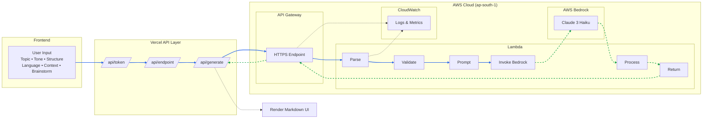

# RachnaX AI - Architecture Diagrams

## System Architecture Overview

### Complete Request Flow



---

## AWS Services Integration

### 1. AWS API Gateway
**Purpose**: HTTP API endpoint management

**Features**:
- RESTful API endpoint
- CORS configuration for web access
- Request/response transformation
- API key authentication
- Rate limiting and throttling
- Request validation
- CloudWatch integration

**Configuration**:
```
Endpoint: https://{api-id}.execute-api.ap-south-1.amazonaws.com/prod/generate
Method: POST
Region: ap-south-1 (Mumbai)
Stage: prod
```

### 2. AWS Lambda
**Purpose**: Serverless compute for business logic

**Specifications**:
- Runtime: Node.js 20.x
- Memory: 512 MB
- Timeout: 30 seconds
- Handler: bedrock-handler.handler
- Execution Role: IAM role with Bedrock permissions

**Responsibilities**:
- Parse and validate requests
- Format prompts with system instructions
- Invoke Bedrock API
- Handle errors gracefully
- Return formatted responses
- Log execution metrics

**IAM Permissions**:
```json
{
  "Effect": "Allow",
  "Action": ["bedrock:InvokeModel"],
  "Resource": "arn:aws:bedrock:ap-south-1::foundation-model/anthropic.claude-3-haiku-20240307-v1:0"
}
```

### 3. AWS Bedrock
**Purpose**: Foundation model access for AI generation

**Model Details**:
- Model ID: `anthropic.claude-3-haiku-20240307-v1:0`
- Provider: Anthropic
- Type: Large Language Model (LLM)
- Capabilities: Text generation, reasoning, multi-language

**Configuration**:
- Max Tokens: 16,000
- Temperature: Default (controlled by model)
- System Prompt: RachnaX AI structured thinking engine
- Anthropic Version: bedrock-2023-05-31

**Why Claude 3 Haiku?**
- Fast response times (< 3 seconds)
- Cost-effective ($0.25 per 1M input tokens)
- High-quality output
- Strong reasoning capabilities
- Multi-language support

### 4. AWS CloudWatch
**Purpose**: Monitoring and logging

**Metrics Tracked**:
- Lambda invocations
- Lambda errors and duration
- API Gateway requests
- API Gateway latency
- Bedrock API calls
- Cost tracking

**Logs**:
- Lambda execution logs
- API Gateway access logs
- Error traces
- Performance metrics

---


## File Structure

```
rachnax/
│
├── Frontend
│   ├── workspace/
│   │   ├── index.html      ← Workspace UI
│   │   ├── index.css       ← Styles
│   │   └── index.js        ← Logic (1618 lines)
│   │
│   └── index.html          ← Homepage
│
├── API (Current - Active)
│   ├── generate.js         ← Fetch
│   ├── endpoint.js         ← Obfuscation
│   └── health.js           ← Health check
│
│
├── Lambda (AWS - Ready)
│   ├── bedrock-handler.js  ← Lambda function
│   ├── package.json        ← Dependencies
│   ├── DEPLOYMENT_GUIDE.md ← Instructions
│   └── README.md           ← Quick reference
│
└── Documentation
    └── ARCHITECTURE_DIAGRAM.md (this file)
```

---

## Deployment Flow

### Current Setup
```
Local Development
    │
    ├─ Edit code
    ├─ Test locally
    └─ Commit to Git
    │
    ▼
Deployment
    │
    ├─ Auto-deploy on push
    ├─ Build project
    ├─ Set environment variables
    └─ Deploy to production
    │
    ▼
Production
    │
    └─ https://rachnax.vercel.app
```

---

## Cost Flow

### Current (Free)
```
10,000 requests/month
    │
    ├─ Vercel: $0 (hobby plan)
    │
    └─ Total: $0/month
```

### AWS Bedrock
```
10,000 requests/month
    │
    ├─ Bedrock (Claude 3 Haiku)
    │   ├─ Input (5M tokens): $1.25
    │   └─ Output (10M tokens): $12.50
    │
    ├─ Lambda
    │   ├─ Requests: $0.01
    │   └─ Compute: $0.01
    │
    ├─ API Gateway
    │   └─ Requests: $0.04
    │
    ├─ CloudWatch Logs: $0.02
    │
    └─ Total: ~$13.80/month
```

---

## Monitoring Flow (AWS)

```
Application
    │
    ▼
API Gateway
    │
    ├─ Access Logs → CloudWatch Logs
    ├─ Execution Logs → CloudWatch Logs
    └─ Metrics → CloudWatch Metrics
    │
    ▼
Lambda Function
    │
    ├─ Function Logs → CloudWatch Logs
    ├─ Invocations → CloudWatch Metrics
    ├─ Errors → CloudWatch Metrics
    ├─ Duration → CloudWatch Metrics
    └─ Throttles → CloudWatch Metrics
    │
    ▼
CloudWatch Alarms
    │
    ├─ Error Rate > 5%
    ├─ Duration > 10s
    └─ Throttles > 0
```

---

## Summary

| Architecture | Status | Cost | Performance |
|--------------|--------|------|-------------|
| **AWS Bedrock** | Active | ~$13.80 | Better |


