# RachnaX AI - Features Overview

## Core Features

### 1. 🎨 Intelligent Content Generation

Transform raw ideas into structured, professional content in seconds.

**Capabilities**:
- **Topic-Based Generation**: Enter any topic and get comprehensive content
- **Tone Adaptation**: 15+ tone options for different contexts
- **Structure Selection**: 10+ content structures (blog, essay, social media, etc.)
- **Language Support**: 19+ Indian languages plus English
- **Context Awareness**: Optional context input for personalized output

**How It Works**:


**Example Use Cases**:
- Student writing an essay on "Climate Change"
- Creator drafting social media posts
- Entrepreneur creating business plan content
- Professional writing technical documentation

---

### 2. 🧠 Strategic Brainstorm Mode

Go beyond simple generation with deep strategic thinking.

**What It Does**:
- Analyzes topics from multiple perspectives
- Identifies hidden assumptions
- Highlights potential blind spots
- Provides strategic frameworks
- Generates actionable insights

**Standard vs. Brainstorm Mode**:

| Feature | Standard Mode | Brainstorm Mode |
|---------|--------------|-----------------|
| Perspectives | Single | Multiple |
| Depth | Focused | Comprehensive |
| Analysis | Direct | Strategic |
| Frameworks | Basic | Advanced |
| Insights | Practical | Strategic |
| Use Case | Quick content | Deep thinking |

**Example Output Structure**:


---

### 3. 🌐 Multi-Language Support

Create content in 19+ Indian languages with cultural context.

**Supported Languages**:

**Major Indian Languages**:
- Hindi (हिंदी)
- Tamil (தமிழ்)
- Telugu (తెలుగు)
- Bengali (বাংলা)
- Marathi (मराठी)
- Gujarati (ગુજરાતી)
- Kannada (ಕನ್ನಡ)
- Malayalam (മലയാളം)
- Punjabi (ਪੰਜਾਬੀ)
- Odia (ଓଡ଼ିଆ)

**Additional Languages**:
- Assamese (অসমীয়া)
- Urdu (اردو)
- Sanskrit (संस्कृत)
- Konkani (कोंकणी)
- Manipuri (মৈতৈলোন্)
- Nepali (नेपाली)
- Sindhi (سنڌي)
- Kashmiri (कॉशुर)
- Dogri (डोगरी)

**Plus**: English (International)

**Language Features**:
- Native script rendering
- Cultural context awareness
- Idiomatic expressions
- Regional tone adaptation
- Proper grammar and syntax

**Example**:

```mermaid
flowchart LR

A[Any Input - Write about Indian festivals]

A --> B[Hindi Output - भारतीय त्योहारों के बारे में]
A --> C[Tamil Output - இந்திய பண்டிகைகள் பற்றி]
A --> D[Telugu Output - భారతీయ పండుగల గురించి]
```


---

### 4. 🎭 15+ Tone Options

Adapt content style to match your audience and purpose.

**Available Tones**:

1. **Professional** - Business communication, formal reports
2. **Casual** - Friendly, conversational content
3. **Academic** - Scholarly, research-oriented
4. **Persuasive** - Convincing, sales-oriented
5. **Technical Deep Dive** - Detailed technical explanations
6. **Cinematic** - Dramatic, storytelling style
7. **Narrative** - Story-driven content
8. **Explanatory** - Clear, educational approach
9. **Informative** - Fact-based, objective
10. **Strategic** - Business strategy focus
11. **Analytical** - Data-driven analysis
12. **Consultant** - Advisory, expert guidance
13. **Opinionated** - Strong viewpoints
14. **Reflective** - Thoughtful, introspective
15. **Inspirational** - Motivational, uplifting

**Tone Impact Examples**:

**Topic**: "Starting a Business"

**Professional Tone**:
> "Establishing a successful business requires careful planning, market research, and strategic execution. Key considerations include..."

**Casual Tone**:
> "So you want to start a business? Cool! Let's break down what you need to know to get started..."

**Academic Tone**:
> "The entrepreneurial process encompasses several critical phases, each requiring distinct competencies and resources..."

---

### 5. 📝 10+ Content Structures

Choose the right format for your content needs.

**Available Structures**:

1. **Blog Post**
   - Introduction
   - Main sections with subheadings
   - Conclusion
   - Call-to-action

2. **Essay**
   - Thesis statement
   - Body paragraphs
   - Evidence and analysis
   - Conclusion

3. **Social Media Post**
   - Hook
   - Key message
   - Hashtags
   - Call-to-action

4. **Technical Documentation**
   - Overview
   - Prerequisites
   - Step-by-step instructions
   - Examples
   - Troubleshooting

5. **Video Script**
   - Opening hook
   - Main content
   - Transitions
   - Closing

6. **Email**
   - Subject line
   - Greeting
   - Body
   - Closing

7. **Report**
   - Executive summary
   - Findings
   - Analysis
   - Recommendations

8. **Presentation**
   - Slide-by-slide content
   - Key points
   - Visual suggestions

9. **Article**
   - Headline
   - Lead paragraph
   - Body sections
   - Conclusion

10. **Script**
    - Scene descriptions
    - Dialogue
    - Action notes

---

### 6. ⚡ Real-Time Generation

Fast, responsive content creation with excellent UX.

**Performance Metrics**:
- Average response time: < 3 seconds
- API Gateway latency: < 100ms
- Lambda execution: < 2 seconds
- Bedrock processing: 1-2 seconds

**User Experience Features**:

**Skeleton Loader**:
```
[████████░░░░░░░░] Generating...
[████████████░░░░] Processing...
[████████████████] Complete!
```

**Progress Indicators**:
- Visual feedback during generation
- Smooth animations
- Clear status messages
- Error recovery

**Responsive Design**:
- Works on desktop, tablet, mobile
- Adaptive layouts
- Touch-friendly controls
- Fast load times

---

### 7. 🎯 Context-Aware Generation

Personalize content with optional context input.

**Context Types**:

**1. Background Information**
```
Context: "This is for a tech startup targeting millennials"
Result: Content adapted for tech-savvy, young audience
```

**2. Specific Requirements**
```
Context: "Include statistics and data points"
Result: Data-driven content with citations
```

**3. Brand Voice**
```
Context: "Maintain friendly, approachable tone"
Result: Consistent brand voice throughout
```

**4. Target Audience**
```
Context: "Writing for beginners with no prior knowledge"
Result: Simplified explanations, no jargon
```

**5. Constraints**
```
Context: "Keep under 500 words, include 3 examples"
Result: Concise content with specific examples
```

---

### 8. 📋 Copy-to-Clipboard

One-click copying of generated content.

**Features**:
- Single-click copy
- Visual confirmation
- Preserves formatting
- Works across browsers

**User Flow**:
```
1. Content generated
2. Click "Copy" button
3. Visual feedback: "Copied!"
4. Paste anywhere
```

---

### 9. 🎨 Markdown Rendering

Beautiful, formatted output with markdown support.

**Supported Formatting**:
- **Bold** and *italic* text
- # Headings (H1-H6)
- Bullet points and numbered lists
- > Blockquotes
- `Code blocks`
- Links and images
- Tables
- Horizontal rules

**Example Output**:
```markdown
# Main Heading

## Subheading

**Key Point**: This is important.

- Bullet point 1
- Bullet point 2
  - Nested point

> Quote or callout

`inline code` and code blocks
```

---

### 10. 🔒 Secure & Private

Enterprise-grade security and privacy protection.

**Security Features**:

**1. Token Authentication**
- Secure token generation
- Server-side validation
- Encrypted transmission

**2. Endpoint Obfuscation**
- Hidden API endpoints
- Server-side encoding
- Protection against scraping

**3. Rate Limiting**
- Per-user limits
- Burst protection
- DDoS prevention

**4. Data Privacy**
- No permanent storage
- Real-time processing only
- No training on user data
- AWS enterprise security

**5. CORS Protection**
- Configured origins
- Method restrictions
- Header validation

---

### 11. 📱 Mobile Responsive

Optimized experience across all devices.

**Breakpoints**:
- Desktop: 1024px+
- Tablet: 768px - 1023px
- Mobile: 320px - 767px

**Mobile Features**:
- Touch-optimized controls
- Adaptive layouts
- Fast load times
- Offline-ready (future)

**Responsive Elements**:
- Collapsible menus
- Stacked layouts
- Large touch targets
- Readable fonts

---

### 12. 🎨 Autocomplete Suggestions

Smart suggestions for faster input.

**Autocomplete For**:

**Topics**:
- "Climate change"
- "Artificial intelligence"
- "Digital marketing"
- "Startup ideas"
- And 50+ more

**Tones**:
- Quick selection
- Visual preview
- Popular options first

**Structures**:
- Common formats
- Use case examples
- Quick access

---

### 13. 🌟 Greeting Animation

Welcoming experience in multiple languages.


**Features**:
- 19 Indian language greetings
- Vertical carousel animation
- Smooth transitions
- Cultural representation

**Languages Displayed**:
```
Namaste (Hindi)
Vanakkam (Tamil)
Namaskaram (Telugu)
Nomoshkar (Bengali)
Namaskar (Marathi)
... and 14 more
```

---

### 14. ⚙️ Customizable Settings

Personalize your experience.

**Settings Options**:
- Default language
- Preferred tone
- Default structure
- Theme (future)
- Shortcuts (future)

---

### 15. 📊 Usage Analytics (Admin)

Track and optimize performance.

**Metrics Tracked**:
- Total generations
- Popular tones
- Language distribution
- Average response time
- Error rates
- User engagement

**Insights**:
- Peak usage times
- Popular features
- Optimization opportunities
- Cost tracking

---

## Feature Comparison

### RachnaX AI vs. Competitors

| Feature | RachnaX AI | ChatGPT | Jasper | Copy.ai |
|---------|-----------|---------|--------|---------|
| Structured Thinking | ✅ | ✅ | ❌ | ❌ |
| Indian Languages | 19+ | Almost | No | No |
| Brainstorm Mode | ✅ | ✅ | ❌ | ❌ |
| AWS Infrastructure | ✅ | ❌ | ❌ | ❌ |
| Tone Options | 15+ | Almost | 10+ | 8+ |
| Structure Types | Manual & Predefined 20+ | Manual | 50+ | 90+ |
| Cost | Low | Medium | High | High |
| Open Source | ✅ | ❌ | ❌ | ❌ |

---

## Considerable Future Features

### Q2 2026
- [ ] Streaming responses
- [ ] Voice input
- [ ] Export to PDF/DOCX

### Q3 2026
- [ ] Multi-model support (Claude 3 Sonnet/Opus)
- [ ] Collaborative editing
- [ ] Version history
- [ ] Templates library

### Q4 2026
- [ ] Mobile apps (iOS/Android)
- [ ] Browser extensions
- [ ] API access for developers
- [ ] Enterprise features

---

**Feature-Rich AI Platform**  
*Built on AWS Bedrock for reliability and scale*


