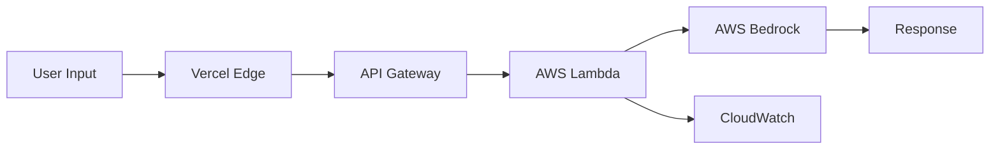

# RachnaX AI - Structured Thinking & Content Creation Platform

[](https://vision.hack2skill.com/event/ai-for-bharat)
[](https://aws.amazon.com/bedrock/)
[](https://www.anthropic.com/claude)
[](LICENSE)

> **AI for Media, Content & Digital Experiences** - Transforming how students, creators, and builders generate structured, high-quality content using AWS Generative AI.

## 🎯 Hackathon Challenge: AI for Media, Content & Digital Experiences

RachnaX AI addresses the critical challenge of **content creation at scale** for India's digital-first generation. Built for the **AI for Bharat Hackathon**, this platform leverages AWS Generative AI services to democratize access to professional-grade content creation tools.

### Problem Statement

In India's rapidly growing digital economy:
- **Students** struggle to articulate complex ideas in structured formats
- **Content creators** face writer's block and time constraints
- **Entrepreneurs** need professional content but lack resources
- **Language barriers** limit content creation in regional languages
- **Quality inconsistency** affects digital presence and credibility

### Our Solution

RachnaX AI is a **structured thinking and execution engine** that transforms raw ideas into polished, publication-ready content using AWS Bedrock's Claude 3 Haiku model.

---

## 🚀 What is RachnaX AI?

RachnaX AI is an intelligent content generation platform that goes beyond simple text generation. It's designed to:

1. **Transform Ideas into Structure** - Convert vague thoughts into organized frameworks
2. **Enhance Thinking Quality** - Improve how users articulate and develop ideas
3. **Generate Publication-Ready Content** - Create professional content across formats
4. **Support Multiple Languages** - Generate content in 19+ Indian languages
5. **Adapt to Context** - Understand tone, structure, and audience requirements

### Key Features

#### 🎨 Intelligent Content Generation
- **Multiple Tones**: Professional, Casual, Academic, Persuasive, Technical, and 11 more
- **Diverse Structures**: Blog posts, Essays, Social media, Technical docs, Scripts
- **Language Support**: English, Hindi, Tamil, Telugu, Bengali, and 15+ Indian languages
- **Context-Aware**: Optional context input for personalized content

#### 🧠 Strategic Brainstorm Mode
- Enables deeper strategic thinking
- Generates multiple perspectives
- Identifies blind spots and trade-offs
- Provides actionable frameworks

#### ⚡ Real-Time Generation
- Fast response times (< 5 seconds)
- Streaming-like experience
- Skeleton loader for better UX
- Error handling and retry logic

#### 🎯 User-Centric Design
- Clean, intuitive interface
- Mobile-responsive design
- Autocomplete suggestions
- Copy-to-clipboard functionality
- Markdown rendering

---

## 🏗️ Architecture & AWS Services

### AWS Services Used

#### 1. **AWS Bedrock** (Foundation Model Access)
- **Model**: Claude 3 Haiku (`anthropic.claude-3-haiku-20240307-v1:0`)
- **Purpose**: Core AI generation engine
- **Why**: Fast, cost-effective, high-quality output with strong reasoning
- **Configuration**: 1,200 max tokens, structured system prompts

#### 2. **AWS Lambda** (Serverless Compute)
- **Runtime**: Node.js 20.x
- **Memory**: 512 MB
- **Purpose**: Business logic and Bedrock API orchestration
- **Why**: Serverless, auto-scaling, pay-per-use, no infrastructure management

#### 3. **AWS API Gateway** (API Management)
- **Type**: REST API
- **Purpose**: HTTP endpoint for Lambda function
- **Why**: Built-in CORS, rate limiting, authentication, monitoring

#### 4. **AWS CloudWatch** (Monitoring & Logging)
- **Purpose**: Logs, metrics, and performance monitoring
- **Why**: Complete observability, error tracking, cost optimization

### Architecture Flow



**Detailed Flow**:
1. User enters content requirements (topic, tone, structure, language)
2. Frontend sends request to Vercel Edge Function
3. Edge Function forwards to AWS API Gateway
4. API Gateway triggers Lambda function
5. Lambda formats prompt with RachnaX AI system instructions
6. Lambda invokes Bedrock Claude 3 Haiku model
7. Bedrock generates structured content
8. Lambda processes and returns response
9. Frontend renders markdown content
10. CloudWatch logs all metrics

**Region**: ap-south-1 (Mumbai) - Optimized for Indian users

---

## 🤖 Why AI is Required

### 1. **Complexity of Structured Thinking**
Human thinking is often non-linear and unstructured. AI helps:
- Organize scattered thoughts into logical frameworks
- Identify gaps in reasoning
- Provide multiple perspectives
- Maintain consistency across long-form content

### 2. **Language Barriers**
India's linguistic diversity creates content challenges:
- Indian languages supported
- Natural language understanding across languages
- Context-aware translations
- Cultural nuances preserved

### 3. **Quality at Scale**
Manual content creation doesn't scale:
- Maintain consistent quality
- Adapt tone and style automatically
- Reduce time from hours to seconds

### 4. **Cognitive Load Reduction**
Content creation is mentally taxing:
- AI handles structure and flow
- Users focus on ideas, not formatting
- Reduces writer's block
- Provides creative suggestions

---

## 💡 How AWS Services Add Value

### AWS Bedrock Value Proposition

#### **Foundation Model Access**
- No need to train custom models
- Access to state-of-the-art Claude 3 Haiku
- Regular model updates from Anthropic
- Enterprise-grade security and compliance

#### **Cost Efficiency**
- Pay only for tokens used
- No infrastructure costs
- No model hosting expenses
- Estimated: ~$13.80 for 10,000 requests

#### **Performance**
- Sub-3-second response times
- High availability (99.9% SLA)
- Auto-scaling based on demand
- Global infrastructure

### AWS Lambda Value Proposition

#### **Serverless Benefits**
- Zero server management
- Automatic scaling (0 to thousands of requests)
- Pay only for execution time
- Built-in fault tolerance

#### **Developer Experience**
- Focus on business logic, not infrastructure
- Easy deployment and updates
- Version control and rollback
- Integrated with AWS ecosystem

### AWS API Gateway Value Proposition

#### **API Management**
- Built-in authentication and authorization
- Rate limiting and throttling
- Request/response transformation
- API versioning

#### **Security**
- HTTPS by default
- API key management
- CORS configuration
- DDoS protection

### AWS CloudWatch Value Proposition

#### **Observability**
- Real-time monitoring
- Custom metrics and alarms
- Log aggregation and search
- Performance insights

#### **Cost Optimization**
- Track usage patterns
- Identify optimization opportunities
- Set budget alerts
- Analyze cost trends

---

## 👥 Who is This For?

### 1. **Students** 🎓
- **Use Case**: Essay writing, research papers, study notes
- **Benefit**: Learn structured thinking while getting help with assignments
- **Example**: Convert lecture notes into comprehensive study guides

### 2. **Content Creators** ✍️
- **Use Case**: Blog posts, social media content, video scripts
- **Benefit**: Overcome writer's block, generate ideas, maintain consistency
- **Example**: Create week's worth of social media content in minutes

### 3. **Entrepreneurs** 🚀
- **Use Case**: Business plans, pitch decks, marketing copy
- **Benefit**: Professional content without hiring expensive writers
- **Example**: Generate investor pitch deck content

### 4. **Educators** 👨‍🏫
- **Use Case**: Lesson plans, educational content, explanations
- **Benefit**: Create engaging educational material quickly
- **Example**: Develop comprehensive lesson plans with activities

### 5. **Professionals** 💼
- **Use Case**: Reports, presentations, documentation
- **Benefit**: Save time on routine writing tasks
- **Example**: Transform meeting notes into formal reports

---

## 🎨 Features in Detail

### Content Generation Modes

#### **Standard Mode**
- Quick, focused content generation
- Single perspective
- Ideal for straightforward topics
- Fast turnaround

#### **Strategic Brainstorm Mode**
- Multi-perspective analysis
- Identifies assumptions and blind spots
- Provides frameworks and action steps
- Deeper strategic thinking

### Tone Options (15+)
- Professional
- Casual
- Academic
- Persuasive
- Technical Deep Dive
- Cinematic
- Narrative
- Explanatory
- Informative
- Strategic
- Analytical
- Consultant
- Opinionated
- Reflective
- And more...

### Structure Types
- Blog Post
- Essay
- Social Media Post
- Technical Documentation
- Video Script
- Email
- Report
- Presentation
- And more...

### Language Support (19+)
- English
- Hindi (हिंदी)
- Tamil (தமிழ்)
- Telugu (తెలుగు)
- Bengali (বাংলা)
- Marathi (मराठी)
- Gujarati (ગુજરાતી)
- Kannada (ಕನ್ನಡ)
- Malayalam (മലയാളം)
- Punjabi (ਪੰਜਾਬੀ)
- And 9 more Indian languages

---

## 🛠️ Technical Stack

### Frontend
- **Framework**: Vanilla JavaScript (ES6+)
- **Styling**: Custom CSS with responsive design
- **Hosting**: Vercel Edge Network
- **Features**: 
  - Markdown rendering
  - Autocomplete
  - Skeleton loaders
  - Copy-to-clipboard
  - Mobile-responsive

### Backend (AWS)
- **Compute**: AWS Lambda (Node.js 20.x)
- **API**: AWS API Gateway (REST)
- **AI**: AWS Bedrock (Claude 3 Haiku)
- **Monitoring**: AWS CloudWatch
- **Region**: ap-south-1 (Mumbai)

### Security
- Token-based authentication
- Endpoint obfuscation
- CORS configuration
- Rate limiting
- Error handling

---

## 📊 Performance Metrics

### Speed
- **Average Response Time**: < 3 seconds
- **API Gateway Latency**: < 100ms
- **Lambda Cold Start**: < 1 second
- **Lambda Warm Start**: < 200ms

### Scalability
- **Concurrent Requests**: Auto-scaling (no limit)
- **Daily Capacity**: Unlimited (AWS managed)
- **Availability**: 99.9% SLA

### Cost Efficiency
- **Per Request**: ~$0.00138
- **10K Requests**: ~$13.80/month
- **100K Requests**: ~$138/month

---

## 🚀 Getting Started

### Prerequisites
- AWS Account with Bedrock access
- Node.js 20.x or later
- AWS CLI configured
- Vercel account (for frontend deployment)

### Quick Setup

1. **Clone Repository**
   ```bash
   git clone https://github.com/ansariheshamraza/rachnax-ai.git
   cd rachnax-ai
   ```

2. **Deploy Lambda Function**
   ```bash
   cd Lambda
   npm install
   npm run package
   # Follow Lambda/DEPLOYMENT_GUIDE.md for AWS deployment
   ```

3. **Configure Environment Variables**
   ```env
   AWS_API_GATEWAY_URL=https://your-api-id.execute-api.ap-south-1.amazonaws.com/prod/generate
   ACCESS_TOKEN=your_secure_token
   ```

4. **Deploy Frontend**
   ```bash
   vercel --prod
   ```

### Detailed Documentation
- **[Lambda Deployment Guide](Lambda/DEPLOYMENT_GUIDE.md)** - Complete AWS setup
- **[Architecture Diagram](ARCHITECTURE_DIAGRAM.md)** - Visual architecture
- **[API Reference](API_FILES_REFERENCE.md)** - API documentation
- **[AWS Quick Start](AWS_QUICK_START.md)** - Quick deployment guide

---

## 📈 Use Cases & Examples

### Example 1: Student Essay
**Input**:
- Topic: "Impact of AI on Education"
- Tone: Academic
- Structure: Essay
- Language: English

**Output**: 1500-word structured essay with introduction, body paragraphs, and conclusion

### Example 2: Social Media Content
**Input**:
- Topic: "Launch of new product"
- Tone: Casual
- Structure: Social Media Post
- Language: Hindi

**Output**: Engaging social media post in Hindi with hashtags

### Example 3: Technical Documentation
**Input**:
- Topic: "API Integration Guide"
- Tone: Technical Deep Dive
- Structure: Technical Documentation
- Language: English
- Context: "REST API with authentication"

**Output**: Comprehensive technical guide with code examples

---

## 🎯 AI for Bharat Hackathon Alignment

### Challenge: AI for Media, Content & Digital Experiences

#### **Why AI is Required**
1. **Scale**: Manual content creation doesn't scale for India's 1.4B population
2. **Quality**: Consistent, professional-grade content for all users
3. **Language**: Support for India's linguistic diversity
4. **Accessibility**: Democratize access to professional writing tools
5. **Speed**: Real-time generation for fast-paced digital world

#### **How AWS Services are Used**
1. **AWS Bedrock**: Foundation model access without training costs
2. **AWS Lambda**: Serverless compute for scalability
3. **AWS API Gateway**: Secure, managed API endpoints
4. **AWS CloudWatch**: Monitoring and optimization

#### **What Value the AI Layer Adds**
1. **Structured Thinking**: Transforms ideas into frameworks
2. **Quality Enhancement**: Professional-grade output
3. **Multi-language**: 19+ Indian languages supported
4. **Context Awareness**: Adapts to user requirements
5. **Strategic Insights**: Brainstorm mode for deeper thinking

### Impact on Indian Digital Economy
- **Students**: Better learning outcomes through structured thinking
- **Creators**: More content, better quality, faster turnaround
- **Businesses**: Professional content without high costs
- **Language Inclusion**: Content in regional languages
- **Skill Development**: Learn structured thinking while creating

---

## 🔒 Security & Privacy

### Data Protection
- No user data stored permanently
- Requests processed in real-time
- No training on user data
- AWS enterprise-grade security

### Authentication
- Token-based access control
- Endpoint obfuscation
- Rate limiting
- CORS protection

### Compliance
- AWS compliance certifications
- Data residency in India (ap-south-1)
- GDPR-ready architecture
- Audit logs via CloudWatch

---

## 📝 License

This project is licensed under the MIT License - see the [LICENSE](LICENSE) file for details.

---

## 🤝 Contributing

We welcome contributions! Please see [CONTRIBUTING.md](CONTRIBUTING.md) for guidelines.

---

## 📧 Contact

- **Website**: [rachnax.vercel.app](https://rachnax.vercel.app)
- **Hackathon**: [AI for Bharat 2026](https://vision.hack2skill.com/event/ai-for-bharat)

---

## 🙏 Acknowledgments

- **AWS** for Bedrock and serverless infrastructure
- **Anthropic** for Claude 3 Haiku model
- **AI for Bharat Hackathon** for the opportunity
- **Indian developer community** for inspiration

---

## 📚 Additional Resources

- [AWS Bedrock Documentation](https://docs.aws.amazon.com/bedrock/)
- [Claude 3 Model Card](https://www.anthropic.com/claude)
- [Lambda Best Practices](https://docs.aws.amazon.com/lambda/latest/dg/best-practices.html)
- [API Gateway Documentation](https://docs.aws.amazon.com/apigateway/)

## 📖 Project Documentation

### For Developers
- **[README.md](README.md)** - This file (project overview)
- **[FEATURES.md](FEATURES.md)** - Detailed feature documentation
- **[TECHNICAL_DEEP_DIVE.md](TECHNICAL_DEEP_DIVE.md)** - Technical implementation details
- **[ARCHITECTURE_DIAGRAM.md](ARCHITECTURE_DIAGRAM.md)** - System architecture diagrams

### For Deployment
- **[Lambda/DEPLOYMENT_GUIDE.md](Lambda/DEPLOYMENT.md)** - Complete AWS deployment guide

### For Hackathon
- **[HACKATHON_SUBMISSION.md](HACKATHON_SUBMISSION.md)** - Hackathon submission document
- **[AI for Bharat Challenge](https://vision.hack2skill.com/event/ai-for-bharat)** - Hackathon details

---

**Built with ❤️ for India's Digital Future**

*Empowering students, creators, and builders with AI-powered structured thinking*


