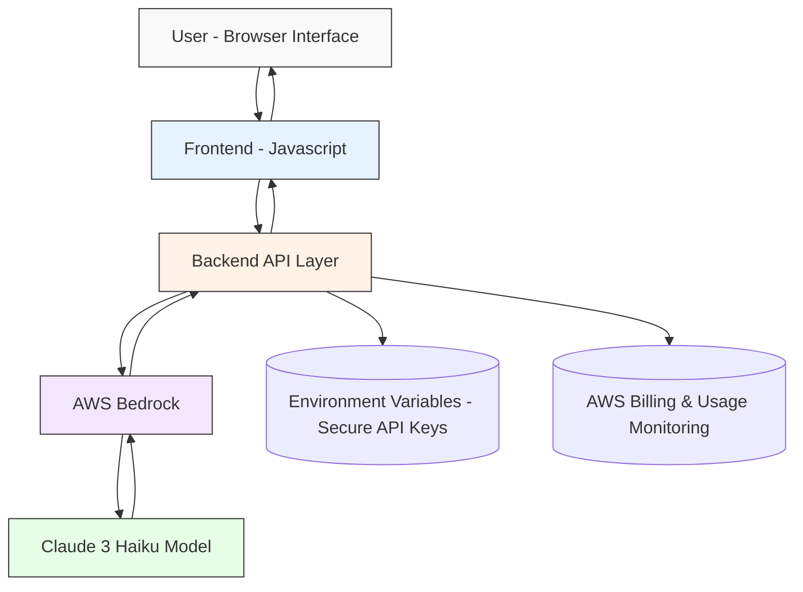

# 🧠 [RachnaX AI](https://rachnax.vercel.app/) – Content Creation Assistant

## 🚀 Overview
RachnaX AI is a structured, multilingual AI workspace designed for Indian students, creators, and early-stage entrepreneurs. Unlike traditional open-ended prompt tools, RachnaX provides a guided creation system where users define intent, audience, tone, and language before generating content.

The platform transforms chaotic prompting into structured, purpose-driven intelligence.

---

## 🎯 Problem

Most AI tools rely on unstructured prompting, leading to:
- Inconsistent outputs
- Poor alignment with user intent
- Difficulty for non-technical users
- Weak multilingual accessibility

Users often struggle more with *writing prompts* than generating content.

---

## 💡 Solution

RachnaX introduces a structured intelligence layer on top of foundation models.

### Key Features:
- ✅ Guided Input Configuration (Intent, Tone, Audience)
- ✅ Optional Brainstorm / Reasoning Mode
- ✅ Multilingual Generation (English, Hindi, Marathi, Hinglish)
- ✅ Structured Output Formatting
- ✅ Secure Backend API Architecture
- ✅ Error Handling & Regeneration Control

Instead of “Ask AI anything,” we enable:
**Configure → Structure → Generate**

---

## 🏗 Current Progress

- ✅ Fully designed and deployed UI/UX
- ✅ Engine routing as per the user identity (eg - Academic Engine, Content Engine, Business Engine & Hybrid Engine)
- ✅ Structured prompt builder implemented
- ✅ Multilingual input-output working
- ✅ Model routing logic designed
- ✅ Backend API integration completed (development-stage model)
- 🔄 AWS Bedrock (Claude 3 Haiku) integration pending credit activation

---

## 🧱 Architecture (High-Level)

RachnaX follows a secure, scalable, API-driven architecture powered by AWS Bedrock.

### Security Approach
- API keys stored in secure Environment variables
- Encrypted HTTPS communication
- Budget monitoring for cost control
- No permanent storage of user content (real-time processign)

---

## ☁ Planned AWS Integration

Upon credit activation:

- AWS Bedrock for AI inference
- Claude 3 Haiku as primary structured generation model
- Optional reasoning model for Brainstorm mode
- Usage monitoring & billing alerts

---

## 🌍 Live Demo

- UI/UX Focused Website
- SEO Optimized
- Google Search Page Ranked
- Currently the Workspace page is not indexed on google - awaiting credits.

🔗 [RachnaX AI](https://rachnax.vercel.app/)

---

## 📸 Screenshots

### Workspace Interface

- Site Preview

- Workspace Preview

- Test Generation Using other Model

---

## 🎯 24-Hour Goal After AWS Credit Activation

- Verify AWS promotional credits are active
- Confirm Bedrock usage consumes credited balance
- Securely integrate Claude 3 Haiku via backend API
- Validate end-to-end structured generation
- Confirm billing visibility and usage monitoring

---

## 📌 Vision

RachnaX aims to become a structured intelligence layer for Bharat — enabling multilingual, guided AI creation for students, thinkers, and builders.

---

## 👤 Founder

- Built by [Ansari Hesham Raza](https://www.linkedin.com/in/ansariheshamraza/)
- Hackathon Submission – AI for Bharat
