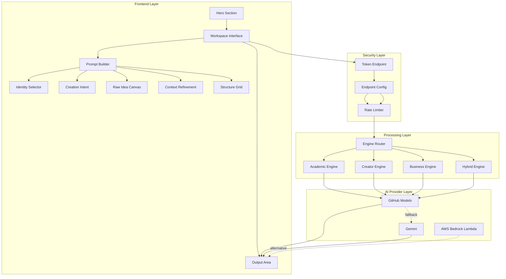
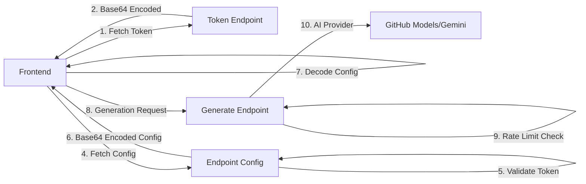
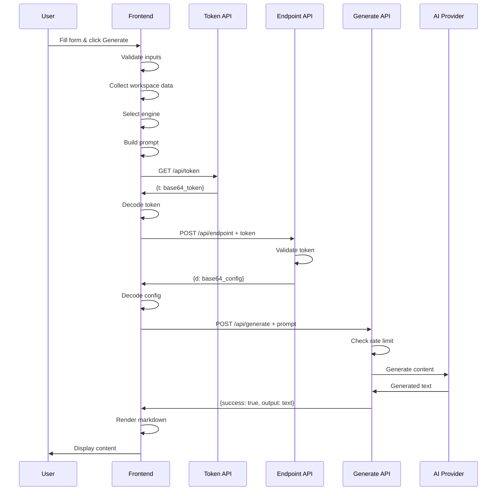
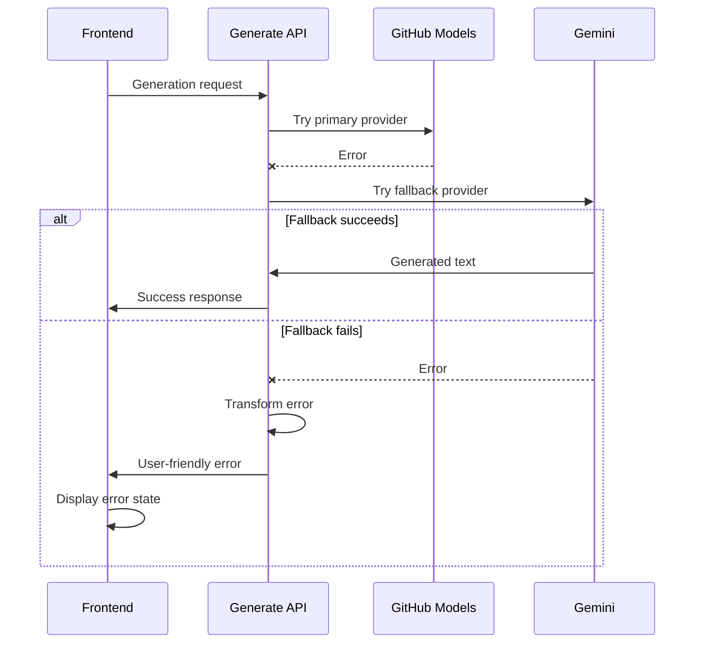
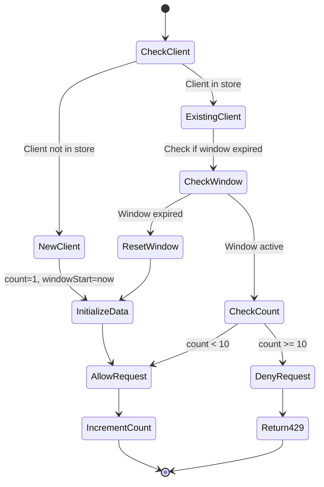

# Design Document: RachnaX AI Workspace Complete System

## Overview

RachnaX AI Workspace is a comprehensive AI-powered content creation platform designed for Indian creators, students, and entrepreneurs. The system provides a guided, structured approach to content generation with intelligent engine routing, context-aware customization, and platform-native output optimization.

### System Purpose

The platform transforms raw ideas into structured, high-quality content by:
- Collecting user identity, intent, and raw ideas through an intuitive interface
- Routing requests to specialized AI engines (Academic, Creator, Business, Hybrid)
- Applying context refinement (audience, platform, tone, complexity, length, language)
- Generating content using multi-provider AI infrastructure (GitHub Models primary, Gemini fallback, AWS Bedrock alternative)
- Rendering markdown-formatted output with copy functionality

### Key Characteristics

- **Reverse-engineered documentation**: This design captures an existing, fully functional implementation
- **Multi-layer security**: Token obfuscation → Endpoint configuration → Rate limiting
- **Responsive design**: 320px to 2560px screen width support
- **Accessibility-first**: WCAG AA compliance with comprehensive ARIA attributes
- **Performance-optimized**: Debouncing, event delegation, CSS transitions
- **Multi-provider AI**: Automatic fallback between GitHub Models and Gemini


## Architecture

### System Architecture Overview



### Deployment Architecture

The system supports two deployment models:

1. **Primary Deployment (Vercel/Node.js)**
   - Frontend: Static HTML/CSS/JS served from workspace/
   - API Layer: Serverless functions in api/
   - AI Providers: GitHub Models (primary) + Gemini (fallback)

2. **Alternative Deployment (AWS Lambda)**
   - Lambda function with Bedrock integration
   - Claude 3 Haiku model
   - API Gateway for HTTP access


### Three-Tier Architecture

**Presentation Tier (Frontend)**
- HTML5 semantic structure
- CSS Grid/Flexbox responsive layouts
- Vanilla JavaScript (no framework dependencies)
- Event delegation for performance
- Debounced updates (300ms)

**Application Tier (API Layer)**
- `/api/token`: Token obfuscation endpoint
- `/api/endpoint`: Dynamic endpoint configuration
- `/api/generate`: Content generation with rate limiting
- `/api/health`: Health check endpoint

**Data Tier (AI Providers)**
- GitHub Models: GPT-4o-mini via Azure inference
- Gemini: 1.5 Flash model
- AWS Bedrock: Claude 3 Haiku (alternative)


## Components and Interfaces

### Frontend Components

#### 1. Hero Section Component

**Purpose**: Landing section with visual effects to engage visitors

**Structure**:
- Particle canvas for cursor trail effects
- Animated gradient backgrounds (purple, blue, orange zones)
- Grid pattern overlay with continuous animation
- Three floating shapes with independent animation cycles
- Interactive 3D mesh canvas
- Badge with sparkle animation
- Title and subtitle
- "Start Creating" CTA button with smooth scroll

**Key Features**:
- Full viewport height
- Centered content layout
- Smooth scroll to workspace on CTA click

#### 2. Greeting Slider Component

**Purpose**: Multilingual welcome animation showcasing Indian language support

**Data Structure**:
```javascript
const greetings = [
  'Namaste', 'Hello', 'नमस्ते', 'નમસ્તે', 'नमस्कार',
  'வணக்கம்', 'ನಮಸ್ಕಾರ', 'నమస్కారం', 'നമസ്കാരം',
  'ਸਤ ਸ੍ਰੀ ਅਕਾਲ', 'প্রণাম', 'Nomoshkar', 'Vanakkam',
  'Namaskara', 'Namaskar', 'Adaab', 'Sat Sri Akal',
  'Khurumjari', 'Nomoskar'
]; // 19 greetings total
```

**Animation Logic**:
- 5 text elements in DOM (hidden-top, prev, current, next, hidden-bottom)
- Slide animation every 3 seconds
- Opacity transitions: 0 → 0.3 → 1 → 0.3 → 0
- Font size transitions: xl → 2xl → 4xl → 2xl → xl
- Infinite loop with array rotation


#### 3. Prompt Builder Component

**Purpose**: Left panel for collecting user input and requirements

**Sub-components**:

**3.1 Identity Selector**
- Input field with autocomplete
- 9 predefined options: Student, Content Creator, Student + Content Creator, Competitive Aspirant, Teacher, Entrepreneur, Business Professional, Freelancer, Marketer
- Required field with inline validation

**3.2 Creation Intent Selector**
- Input field with autocomplete
- 17 content types: Academic Assignment, Exam Answer, Topic Explanation, Research Paper, Debate Speech, Blog Post, Instagram Script, Instagram Caption, YouTube Script, Storytelling Post, Podcast Script, Article, SEO Article, Cold Email, Sales Page, Landing Page, Startup Pitch
- Triggers structure grid update (debounced 300ms)
- Required field with inline validation

**3.3 Raw Idea Canvas**
- Multi-line textarea
- Vertical resize capability
- Required field with inline validation

**3.4 Brainstorm Mode Toggle**
- iOS-style toggle switch
- Default: off
- When enabled: adds strategic insights section to prompt
- Different insight templates per engine

**3.5 Context Refinement Section**
- Collapsible section (collapsed by default)
- Toggle button with rotating arrow icon
- Contains 6 customization fields:
  - Target Audience (autocomplete, 17 options)
  - Platform (autocomplete, 17 options)
  - Tone (dropdown, 17 options)
  - Language Complexity (dropdown, 3 options: Simple, Intermediate, Advanced)
  - Output Length (dropdown, 3 options: Short, Medium, Long)
  - Output Language (dropdown, 22 languages)


#### 4. Structure Grid Component

**Purpose**: Dynamic UI for selecting content structure elements

**Behavior**:
- Displays placeholder when no creation intent selected
- Updates dynamically when creation intent changes (debounced 300ms)
- Renders structure options as pill-shaped toggle buttons
- Multiple selection allowed
- Selected state: purple background, white text
- Unselected state: light purple background, purple text

**Structure Mappings**:
```javascript
const structureOptions = {
  "Blog Post": ["Introduction", "Key Points", "Conclusion", "Examples", "Summary"],
  "Instagram Script": ["Hook", "Story Arc", "Call to Action", "Hashtags"],
  "YouTube Script": ["Hook", "Main Content", "Transitions", "Outro"],
  "Academic Assignment": ["Introduction", "Body", "Conclusion", "References"],
  "Article": ["Headline", "Introduction", "Background", "Main Discussion", "Expert Insight", "Conclusion"],
  "SEO Article": ["Meta Title", "Meta Description", "Introduction", "Subheadings", "FAQs", "Conclusion"],
  "Instagram Caption": ["Hook Line", "Story/Value", "Engagement Question", "Call to Action", "Hashtags"],
  "Podcast Script": ["Opening Hook", "Introduction", "Main Discussion", "Guest Segment", "Key Takeaways", "Closing"],
  "Cold Email": ["Subject Line", "Personalization", "Problem", "Solution", "Call to Action", "Closing"],
  "Sales Page": ["Headline", "Subheadline", "Problem", "Solution", "Benefits", "Testimonials", "Offer", "CTA"],
  "Landing Page": ["Hero Section", "Problem", "Solution", "Features", "Benefits", "Social Proof", "CTA"],
  "Topic Explanation": ["Definition", "Core Concept", "Examples", "Applications", "Summary"],
  "Research Paper": ["Abstract", "Introduction", "Methodology", "Results", "Discussion", "Conclusion", "References"],
  "Debate Speech": ["Opening Statement", "Arguments", "Supportive Points", "Against Points", "Rebuttal", "Conclusion"],
  "Startup Pitch": ["Problem", "Solution", "Market Opportunity", "Product", "Business Model", "Traction", "Ask"],
  "Storytelling Post": ["Hook", "Setup", "Conflict", "Turning Point", "Resolution", "Lesson"],
  "Exam Answer": ["Direct Answer", "Explanation", "Examples", "Summary"]
};
```


#### 5. Autocomplete Component

**Purpose**: Provide suggestion dropdowns for input fields

**Features**:
- Keyboard navigation (ArrowUp, ArrowDown, Enter, Escape)
- Click selection
- Filter suggestions based on input
- Scroll selected item into view
- Close on outside click
- Visual highlight for selected suggestion

**Data Sources**:
```javascript
const autocompleteSuggestions = {
  'identity-selector': [9 options],
  'creation-intent-selector': [17 options],
  'target-audience': [17 options],
  'platform': [17 options]
};
```

**Interaction Flow**:
1. Focus → Show all suggestions
2. Type → Filter suggestions
3. ArrowDown/Up → Navigate
4. Enter → Select
5. Escape → Close
6. Click outside → Close


#### 6. Output Area Component

**Purpose**: Right panel for displaying generated content

**States**:

**6.1 Placeholder State**
- Initial state before generation
- Displays prompt to start creating

**6.2 Loading State (Skeleton Loader)**
- Animated skeleton lines (12 lines with shimmer effect)
- Status messages with icons (7 steps, 2.5s each):
  1. 🔍 "Analyzing your input..."
  2. 🎨 "Refining your prompt..."
  3. 🧠 "Understanding your objective..."
  4. 🎯 "Mapping intent and audience..."
  5. ✨ "Crafting personalized content..."
  6. 📝 "Structuring your output..."
  7. 🚀 "Almost there..."
- Fade transitions (300ms) between status messages
- aria-busy="true" for accessibility

**6.3 Content State**
- Rendered markdown content
- Copy button with clipboard icon
- Tooltip feedback ("Copied!" or error message)

**6.4 Error State**
- Warning icon (⚠️)
- Error message with role="alert"
- "Regenerate" button to retry


#### 7. Markdown Renderer Component

**Purpose**: Parse and render markdown content with XSS protection

**Supported Syntax**:
- Headings: # through ######
- Bold: **text** or __text__
- Italic: *text* or _text_
- Inline code: `code`
- Code blocks: ```language\ncode\n```
- Unordered lists: -, *, +
- Ordered lists: 1., 2., 3.
- Paragraphs: automatic wrapping

**Processing Order** (critical for correctness):
1. Escape HTML characters (&, <, >)
2. Process code blocks (before inline code)
3. Process inline code
4. Process headings (h6 → h1)
5. Process bold (before italic)
6. Process italic
7. Process lists
8. Wrap remaining text in paragraphs

**CSS Classes Applied**:
- `.markdown-h1` through `.markdown-h6`
- `.markdown-bold`, `.markdown-italic`
- `.markdown-inline-code`, `.markdown-code-block`
- `.markdown-ul`, `.markdown-ol`, `.markdown-list-item`
- `.markdown-paragraph`


### Backend Components

#### 1. Token Obfuscation Endpoint (`/api/token`)

**Purpose**: Provide obfuscated access token to frontend

**Method**: GET

**Response**:
```json
{
  "t": "base64_encoded_token"
}
```

**Security Design**:
- Token stored in environment variable (ACCESS_TOKEN)
- Base64 encoding for obfuscation (not encryption)
- Frontend decodes using atob()
- CORS enabled for all origins

**Error Handling**:
- 500 if ACCESS_TOKEN not configured
- 405 for non-GET requests


#### 2. Endpoint Configuration (`/api/endpoint`)

**Purpose**: Dynamically deliver API endpoint configuration with token validation

**Methods**: POST (production), GET (admin testing)

**POST Request**:
```json
{
  "v": "v1"
}
```

**Headers**:
- `X-Request-Token`: decoded access token

**Response**:
```json
{
  "d": "base64_encoded_config"
}
```

**Decoded Configuration**:
```json
{
  "e": "/api/generate",
  "m": "POST",
  "h": {
    "Content-Type": "application/json"
  }
}
```

**Security Features**:
- Token validation against ACCESS_TOKEN
- Character code obfuscation for endpoint strings
- Base64 encoding of final configuration
- Version validation (v1)

**GET Request** (Admin Testing):
- URL: `/api/endpoint?token=YOUR_ACCESS_TOKEN`
- Returns decoded configuration for verification

**Error Handling**:
- 403 if token validation fails
- 400 if version validation fails
- 405 for unsupported methods


#### 3. Rate Limiter Component

**Purpose**: Prevent API abuse with sliding window rate limiting

**Configuration**:
- Limit: 10 requests per minute per IP
- Window: 60 seconds (sliding)
- Storage: In-memory Map (resets on serverless restart)

**Client Identification** (priority order):
1. `X-Forwarded-For` header (first IP)
2. `X-Real-IP` header
3. `CF-Connecting-IP` header (Cloudflare)
4. Socket remote address
5. Fallback: "unknown"

**Data Structure**:
```javascript
rateLimitStore = Map {
  "client_ip": {
    count: number,
    windowStart: timestamp
  }
}
```

**Algorithm**:
1. Check if client exists in store
2. If not, initialize with count=1, windowStart=now
3. If window expired (now - windowStart > 60s), reset
4. If count >= 10, return 429 with Retry-After header
5. Otherwise, increment count

**Response Headers**:
- `X-RateLimit-Limit`: 10
- `X-RateLimit-Remaining`: requests remaining
- `X-RateLimit-Reset`: ISO timestamp when limit resets
- `Retry-After`: seconds until reset (on 429)

**Cleanup**:
- Periodic cleanup every 60 seconds
- Removes expired entries from store


#### 4. Engine Router Component

**Purpose**: Route generation requests to appropriate prompt engine

**Routing Logic**:

```javascript
function selectEngine(identity, creationIntent) {
  // Academic Pattern
  const academicIdentities = ['Student', 'Teacher', 'Competitive Aspirant'];
  const academicIntents = ['Academic Assignment', 'Exam Answer', 'Topic Explanation', 
                           'Research Paper', 'Debate Speech'];
  if (academicIdentities.includes(identity) && academicIntents.includes(creationIntent)) {
    return 'academic_engine';
  }
  
  // Business Pattern
  const businessIdentities = ['Entrepreneur', 'Business Professional', 'Marketer'];
  const businessIntents = ['SEO Article', 'Cold Email', 'Sales Page', 
                           'Landing Page', 'Startup Pitch'];
  if (businessIdentities.includes(identity) && businessIntents.includes(creationIntent)) {
    return 'business_engine';
  }
  
  // Creator Pattern
  const creatorIdentities = ['Content Creator', 'Influencer'];
  const creatorIntents = ['Blog Post', 'Instagram Script', 'Instagram Caption', 
                          'YouTube Script', 'Storytelling Post', 'Podcast Script', 'Article'];
  if (creatorIdentities.includes(identity) && creatorIntents.includes(creationIntent)) {
    return 'creator_engine';
  }
  
  // Default: Hybrid
  return 'hybrid_engine';
}
```

**Design Rationale**:
- Identity + Intent pattern matching ensures content is optimized for user context
- Academic engine: logical structure, analytical depth
- Creator engine: engagement hooks, platform optimization
- Business engine: conversion focus, value proposition
- Hybrid engine: balanced approach for mixed requirements


#### 5. Prompt Engine Templates

**5.1 Academic Engine Template**

**Characteristics**:
- Formal tone (default)
- Logical flow emphasis
- Deep reasoning with examples
- Exact structure adherence

**Brainstorm Mode** (when enabled):
```
## Academic Insights (max 120 words)
### Refined Thesis
### Argument Pillars (3)
### Counterpoint
### Depth Improvement
### Structure Refinement
```

**5.2 Creator Engine Template**

**Characteristics**:
- Casual tone (default)
- Strong hook at beginning
- Emotional/value-driven flow
- Platform-specific adaptation
- CTA inclusion

**Brainstorm Mode** (when enabled):
```
## Idea Breakdown (max 130 words)
### Power (2 strengths)
### Risks (2)
### Improvement (2)
### Flow Roadmap (4 steps)
### Platform Fit (hook, retention, CTA)
```

**5.3 Business Engine Template**

**Characteristics**:
- Professional tone (default)
- Value proposition first
- Pain point addressing
- Benefits over features
- Conversion focus

**Brainstorm Mode** (when enabled):
```
## Strategic Snapshot (max 120 words)
### Market Angle
### Key Risk
### Value Refinement
### Conversion Path (4 steps)
```

**5.4 Hybrid Engine Template**

**Characteristics**:
- Balanced tone (default)
- Clear structure + engaging flow
- Complex idea simplification
- Authority maintenance

**Brainstorm Mode** (when enabled):
```
## Refinement Notes (max 100 words)
### Idea Strengthening
### Structure Improvement
### Engagement Boost
### Tone Calibration
### Audience Alignment
```


#### 6. Content Generation API (`/api/generate`)

**Purpose**: Generate content using AI providers with fallback

**Method**: POST

**Request Body**:
```json
{
  "prompt": "string (required)",
  "engine": "string",
  "language": "string"
}
```

**Response** (Success):
```json
{
  "success": true,
  "output": "generated content",
  "engine": "engine_id",
  "language": "language_code",
  "model": "anthropic.claude-3-haiku-20240307-v1:0"
}
```

**Response** (Error):
```json
{
  "success": false,
  "message": "user-friendly error message"
}
```

**AI Provider Flow**:
1. Check rate limits
2. Validate prompt exists
3. Attempt GitHub Models (GPT-4o-mini)
4. If fails, attempt Gemini (1.5 Flash)
5. If both fail, return "Generation service unavailable"

**Error Transformation**:
- "401"/"Unauthorized" → "Authentication failed"
- "404" → "Service not found"
- "429" → "Rate limit exceeded"
- "timeout" → "Request timeout"
- Generic → User-friendly message

**Security**:
- Rate limiting enforced before processing
- CORS enabled
- Environment variable validation


#### 7. AI Provider Integrations

**7.1 GitHub Models (Primary)**

**Configuration**:
- Base URL: `https://models.inference.ai.azure.com`
- Model: `gpt-4o-mini`
- SDK: OpenAI SDK
- Token: `GITHUB_TOKEN` environment variable

**Request Structure**:
```javascript
{
  model: "gpt-4o-mini",
  messages: [
    { role: "system", content: systemPrompt },
    { role: "user", content: userPrompt }
  ],
  max_completion_tokens: 16000
}
```

**7.2 Gemini (Fallback)**

**Configuration**:
- Model: `gemini-1.5-flash`
- SDK: @google/genai
- API Key: `GEMINI_API_KEY` environment variable

**Request Structure**:
```javascript
{
  model: "gemini-1.5-flash",
  contents: `${systemPrompt}\n\nUser Query: ${userPrompt}`
}
```

**7.3 AWS Bedrock (Alternative Deployment)**

**Configuration**:
- Model: `anthropic.claude-3-haiku-20240307-v1:0`
- Region: `AWS_REGION` environment variable (default: ap-south-1)
- Runtime: Node.js 20.x
- SDK: @aws-sdk/client-bedrock-runtime

**Request Structure**:
```javascript
{
  anthropic_version: "bedrock-2023-05-31",
  max_tokens: 16000,
  messages: [
    { role: "user", content: prompt }
  ],
  system: systemPrompt
}
```

**IAM Requirements**:
- Permission: `bedrock:InvokeModel`
- Resource: Model ARN

**Error Handling**:
- ValidationException → 400
- AccessDeniedException → 403
- ThrottlingException → 429
- ModelTimeoutException → 504


#### 8. Health Check Endpoint (`/api/health`)

**Purpose**: Verify API availability

**Method**: All methods supported

**Response**:
```json
{
  "status": "ok",
  "message": "API is running",
  "timestamp": "2024-01-01T00:00:00.000Z",
  "env": {
    "nodeVersion": "v20.x.x"
  }
}
```

**Use Cases**:
- Monitoring/uptime checks
- Deployment verification
- Load balancer health checks


## Data Models

### WorkspaceData Model

**Purpose**: Encapsulates all user input and configuration for content generation

```typescript
interface WorkspaceData {
  // Required fields
  identity: string;              // User's role/identity
  creationIntent: string;        // Type of content to create
  rawIdea: string;              // User's raw idea/topic
  
  // Context refinement (optional)
  contextRefinement: {
    audience: string | null;     // Target audience
    platform: string | null;     // Publishing platform
    tone: string | null;         // Content tone
    languageComplexity: string | null;  // Simple/Intermediate/Advanced
    length: string | null;       // Short/Medium/Long
    language: string;            // Output language (default: English)
  };
  
  // Structure customization
  structureCustomization: string[];  // Selected structure elements
  
  // Features
  brainstormMode: boolean;       // Enable strategic insights
}
```

**Validation Rules**:
- `identity`: Required, non-empty string
- `creationIntent`: Required, non-empty string
- `rawIdea`: Required, non-empty string
- `contextRefinement.language`: Defaults to "English" if not specified
- All other fields: Optional


### RateLimitData Model

**Purpose**: Track request counts per client for rate limiting

```typescript
interface RateLimitData {
  count: number;        // Number of requests in current window
  windowStart: number;  // Timestamp when window started (milliseconds)
}

// Storage
type RateLimitStore = Map<string, RateLimitData>;
```

**Lifecycle**:
- Created on first request from client
- Reset when window expires (60 seconds)
- Cleaned up periodically to prevent memory leaks

### AutocompleteSuggestions Model

**Purpose**: Define suggestion lists for autocomplete fields

```typescript
interface AutocompleteSuggestions {
  'identity-selector': string[];        // 9 identity options
  'creation-intent-selector': string[]; // 17 content type options
  'target-audience': string[];          // 17 audience options
  'platform': string[];                 // 17 platform options
}
```

### StructureOptions Model

**Purpose**: Map content types to structure elements

```typescript
type StructureOptions = {
  [contentType: string]: string[];  // Content type → structure elements
};

// Example:
// "Blog Post" → ["Introduction", "Key Points", "Conclusion", "Examples", "Summary"]
```


### API Request/Response Models

**Token Response**:
```typescript
interface TokenResponse {
  t: string;  // Base64-encoded access token
}
```

**Endpoint Configuration Response**:
```typescript
interface EndpointConfigResponse {
  d: string;  // Base64-encoded configuration
}

// Decoded configuration:
interface EndpointConfig {
  e: string;  // Endpoint path
  m: string;  // HTTP method
  h: {        // Headers
    [key: string]: string;
  };
}
```

**Generation Request**:
```typescript
interface GenerationRequest {
  prompt: string;      // Required: formatted prompt
  engine: string;      // Engine identifier
  language: string;    // Language code
}
```

**Generation Response**:
```typescript
interface GenerationResponse {
  success: boolean;
  output?: string;     // Generated content (on success)
  message?: string;    // Error message (on failure)
  engine?: string;     // Engine used
  language?: string;   // Language used
  model?: string;      // Model identifier
}
```

**Rate Limit Error Response**:
```typescript
interface RateLimitError {
  success: false;
  message: string;
  retryAfter: number;  // Seconds until reset
  limit: number;       // Max requests per window
  window: string;      // Window duration description
}
```


### System Prompt Model

**Purpose**: Define AI behavior and operational framework

```typescript
interface SystemPrompt {
  identity: string;           // "RachnaX AI — structured thinking engine"
  targetAudience: string;     // "ambitious students, creators, builders"
  coreMission: string[];      // 4 mission statements
  operationalPrinciples: {
    structureFirst: string;
    depthWithClarity: string;
    executionOrientation: string;
    strategicThinking: string;
    authorityLevel: string;
    adaptiveMode: string;
    tone: string;
  };
  responseStyle: string[];    // Formatting guidelines
  prohibitions: string[];     // What to avoid
}
```

**Constant Value**:
The system prompt is a fixed string constant that defines RachnaX AI's identity, mission, operational principles, and response style. It is prepended to all AI generation requests to ensure consistent behavior across all engines.

**Key Principles**:
1. Structure First: Headings, sections, bullet points
2. Depth With Clarity: No oversimplification, no jargon
3. Execution Orientation: Action steps, frameworks, practical application
4. Strategic Thinking: Assumptions, trade-offs, risks, alternatives
5. Authority-Level Content: High insight density, publish-ready
6. Adaptive Mode: Academic/startup/content/confusion handling
7. Tone: Calm, logical, structured, professional


## Correctness Properties

*A property is a characteristic or behavior that should hold true across all valid executions of a system—essentially, a formal statement about what the system should do. Properties serve as the bridge between human-readable specifications and machine-verifiable correctness guarantees.*

### Property Reflection

After analyzing all acceptance criteria, the following properties were identified as testable through property-based testing. Redundant properties have been eliminated through the following analysis:

**Eliminated Redundancies**:
- Structure mapping validation subsumes individual content type checks
- Engine routing property covers all identity+intent combinations
- Validation property covers all required field checks
- Template construction properties can be combined per engine

**Retained Properties** (each provides unique validation value):
1. Structure mapping completeness
2. Engine routing correctness
3. Input validation behavior
4. Prompt template construction per engine
5. Markdown round-trip preservation
6. Token encoding/decoding round-trip
7. Endpoint configuration round-trip
8. Rate limiting window behavior
9. Error message transformation


### Property 1: Structure Mapping Completeness

*For any* creation intent value in the autocomplete suggestions, the structure options mapping should contain a corresponding entry with a non-empty array of structure elements.

**Validates: Requirements 7.4-7.20**

**Rationale**: Ensures every selectable content type has defined structure options, preventing undefined behavior when users select a creation intent.

### Property 2: Engine Routing Determinism

*For any* valid combination of identity and creation intent, the engine router should consistently return the same engine identifier across multiple invocations.

**Validates: Requirements 9.1-9.24**

**Rationale**: Engine routing must be deterministic to ensure consistent content generation behavior for the same inputs.

### Property 3: Engine Routing Pattern Correctness

*For any* identity in academic identities (Student, Teacher, Competitive Aspirant) and creation intent in academic intents (Academic Assignment, Exam Answer, Topic Explanation, Research Paper, Debate Speech), the engine router should return 'academic_engine'.

*For any* identity in business identities (Entrepreneur, Business Professional, Marketer) and creation intent in business intents (SEO Article, Cold Email, Sales Page, Landing Page, Startup Pitch), the engine router should return 'business_engine'.

*For any* identity in creator identities (Content Creator, Influencer) and creation intent in creator intents (Blog Post, Instagram Script, Instagram Caption, YouTube Script, Storytelling Post, Podcast Script, Article), the engine router should return 'creator_engine'.

*For any* other valid combination, the engine router should return 'hybrid_engine'.

**Validates: Requirements 9.1-9.24**

**Rationale**: Validates the complete routing logic ensures correct engine selection for all identity+intent patterns.


### Property 4: Required Field Validation

*For any* workspace data where identity, creation intent, or raw idea is empty or whitespace-only, the validation function should return an error array containing the corresponding field error.

**Validates: Requirements 8.1-8.12**

**Rationale**: Ensures all required fields are validated before content generation, preventing incomplete requests.

### Property 5: Academic Engine Template Construction

*For any* valid workspace data routed to the academic engine, the generated prompt should include the identity, creation intent, raw idea, context refinement values, structure elements, and language specification, with brainstorm insights section included when brainstorm mode is enabled.

**Validates: Requirements 10.1-10.17**

**Rationale**: Validates that academic engine templates are constructed correctly with all required components.

### Property 6: Creator Engine Template Construction

*For any* valid workspace data routed to the creator engine, the generated prompt should include the creation intent, platform, audience, raw idea, context refinement values, structure elements, and language specification, with idea breakdown section included when brainstorm mode is enabled.

**Validates: Requirements 11.1-11.19**

**Rationale**: Validates that creator engine templates are constructed correctly with platform-specific optimizations.

### Property 7: Business Engine Template Construction

*For any* valid workspace data routed to the business engine, the generated prompt should include the identity, creation intent, audience, platform, raw idea, context refinement values, structure elements, and language specification, with strategic snapshot section included when brainstorm mode is enabled.

**Validates: Requirements 12.1-12.18**

**Rationale**: Validates that business engine templates are constructed correctly with conversion focus.


### Property 8: Hybrid Engine Template Construction

*For any* valid workspace data routed to the hybrid engine, the generated prompt should include the identity, creation intent, audience, platform, raw idea, context refinement values, structure elements, and language specification, with refinement notes section included when brainstorm mode is enabled.

**Validates: Requirements 13.1-13.18**

**Rationale**: Validates that hybrid engine templates are constructed correctly with balanced approach.

### Property 9: Token Encoding Round-Trip

*For any* valid access token string, encoding it to base64 and then decoding it should produce the original token string.

**Validates: Requirements 18.1-18.12**

**Rationale**: Ensures token obfuscation preserves token integrity through encoding/decoding cycle.

### Property 10: Endpoint Configuration Round-Trip

*For any* valid endpoint configuration object (containing endpoint path, method, and headers), encoding it to JSON then base64, and then decoding via base64 then JSON parsing, should produce an equivalent configuration object.

**Validates: Requirements 19.1-19.18**

**Rationale**: Ensures endpoint configuration encoding/decoding preserves configuration integrity.

### Property 11: Rate Limit Window Behavior

*For any* client identifier, making N requests within a 60-second window where N ≤ 10 should all succeed, and the (N+1)th request should return a 429 status code with appropriate retry-after header.

**Validates: Requirements 20.1-20.17**

**Rationale**: Validates that rate limiting correctly enforces the 10 requests per minute limit with sliding window.


### Property 12: Rate Limit Window Reset

*For any* client identifier that has exhausted their rate limit, waiting for the window to expire (60+ seconds) should reset their request count, allowing new requests to succeed.

**Validates: Requirements 20.8**

**Rationale**: Ensures rate limit windows properly reset after expiration, allowing continued use.

### Property 13: Error Message Transformation

*For any* error message containing specific keywords ("401", "Unauthorized", "404", "429", "timeout"), the error transformation function should return the corresponding user-friendly message.

**Validates: Requirements 24.14-24.18**

**Rationale**: Ensures technical error messages are consistently transformed into user-friendly messages.

### Property 14: Markdown Heading Preservation

*For any* markdown text containing heading syntax (# through ######), rendering to HTML and extracting heading text should preserve the heading content.

**Validates: Requirements 15.1**

**Rationale**: Validates that markdown heading parsing correctly preserves heading text content.

### Property 15: Markdown Bold/Italic Preservation

*For any* markdown text containing bold (**text** or __text__) or italic (*text* or _text_) syntax, rendering to HTML should preserve the emphasized text content within appropriate HTML tags.

**Validates: Requirements 15.2-15.3**

**Rationale**: Validates that markdown emphasis parsing correctly preserves text content and applies appropriate styling.


### Property 16: Markdown XSS Protection

*For any* markdown text containing HTML special characters (&, <, >), the rendering function should escape these characters before processing markdown syntax, preventing XSS attacks.

**Validates: Requirements 15.10**

**Rationale**: Ensures markdown renderer protects against XSS by escaping HTML before rendering.

### Property 17: AWS Lambda Error Status Codes

*For any* AWS Bedrock error of type ValidationException, AccessDeniedException, ThrottlingException, or ModelTimeoutException, the Lambda handler should return status codes 400, 403, 429, or 504 respectively.

**Validates: Requirements 26.17-26.20**

**Rationale**: Validates that AWS-specific errors are mapped to appropriate HTTP status codes.


## Error Handling

### Frontend Error Handling

**Validation Errors**:
- Display inline error messages below invalid fields
- Apply red border to invalid fields
- Set aria-invalid="true" for accessibility
- Focus first invalid field
- Clear errors when user corrects input

**Generation Errors**:
- Hide skeleton loader
- Display error state with warning icon
- Show user-friendly error message
- Provide "Regenerate" button for retry
- Log error details to console

**Network Errors**:
- Catch fetch failures
- Display generic error message
- Provide retry functionality
- Log error for debugging

### Backend Error Handling

**Rate Limiting**:
- Return 429 status code
- Include Retry-After header
- Provide clear error message
- Set rate limit headers

**Validation Errors**:
- Return 400 status code
- Specify missing/invalid fields
- Provide actionable error messages

**Authentication Errors**:
- Return 403 status code
- Generic "Forbidden" message (no details)
- Log authentication failures

**AI Provider Errors**:
- Attempt fallback provider
- Transform technical errors to user-friendly messages
- Return 500 status code for service failures
- Log provider errors for monitoring


### AWS Lambda Error Handling

**Bedrock-Specific Errors**:
- ValidationException → 400 "Invalid request parameters"
- AccessDeniedException → 403 "Access denied to Bedrock model"
- ThrottlingException → 429 "Rate limit exceeded"
- ModelTimeoutException → 504 "Model request timeout"

**Generic Errors**:
- Return 500 status code
- User-friendly error message
- Include error details in response body
- Log full error stack for debugging

### Error Logging Strategy

**Frontend Logging**:
- Console.log for informational events
- Console.warn for validation issues
- Console.error for generation failures
- Console.group for organized log sections
- Colored output for readability
- Never log sensitive data (tokens, API keys)

**Backend Logging**:
- Log rate limit violations
- Log authentication failures
- Log AI provider errors
- Log environment configuration issues
- Include timestamps in error logs
- Never expose environment variables in logs


## Testing Strategy

### Dual Testing Approach

The system requires both unit testing and property-based testing for comprehensive coverage:

**Unit Tests**: Verify specific examples, edge cases, and error conditions
- Specific input/output examples
- Integration points between components
- Edge cases (empty strings, special characters, boundary values)
- Error conditions and error message formatting

**Property Tests**: Verify universal properties across all inputs
- Universal properties that hold for all inputs
- Comprehensive input coverage through randomization
- Minimum 100 iterations per property test
- Each property test references its design document property

Together, unit tests catch concrete bugs while property tests verify general correctness.

### Property-Based Testing Configuration

**Library Selection**:
- JavaScript/Node.js: fast-check
- Rationale: Mature PBT library with excellent TypeScript support and shrinking capabilities

**Test Configuration**:
```javascript
import fc from 'fast-check';

// Minimum 100 iterations per property
fc.assert(
  fc.property(
    fc.string(), // arbitrary generators
    (input) => {
      // property assertion
    }
  ),
  { numRuns: 100 }
);
```

**Tagging Convention**:
Each property test must include a comment tag referencing the design property:
```javascript
// Feature: rachnax-ai-workspace-complete-system, Property 1: Structure Mapping Completeness
test('structure mapping contains all creation intents', () => {
  // property test implementation
});
```


### Unit Testing Strategy

**Frontend Unit Tests**:
- Validation logic with specific invalid inputs
- Autocomplete filtering with known search terms
- Structure grid updates with specific creation intents
- Markdown rendering with specific markdown syntax examples
- Error display with specific error scenarios

**Backend Unit Tests**:
- Token endpoint with missing environment variable
- Endpoint configuration with invalid tokens
- Rate limiter with specific request sequences
- Engine router with specific identity+intent combinations
- Error transformation with specific error messages

**Integration Tests**:
- Frontend-backend communication flow
- Token fetch → endpoint config → generation request
- Error handling across component boundaries
- Fallback provider switching

### Property-Based Testing Strategy

**Property Test Categories**:

1. **Data Structure Properties**:
   - Structure mapping completeness (Property 1)
   - Autocomplete suggestion counts

2. **Routing Properties**:
   - Engine routing determinism (Property 2)
   - Engine routing pattern correctness (Property 3)

3. **Validation Properties**:
   - Required field validation (Property 4)

4. **Template Construction Properties**:
   - Academic engine template (Property 5)
   - Creator engine template (Property 6)
   - Business engine template (Property 7)
   - Hybrid engine template (Property 8)

5. **Encoding Round-Trip Properties**:
   - Token encoding/decoding (Property 9)
   - Endpoint configuration encoding/decoding (Property 10)

6. **Rate Limiting Properties**:
   - Rate limit window behavior (Property 11)
   - Rate limit window reset (Property 12)

7. **Error Handling Properties**:
   - Error message transformation (Property 13)
   - AWS Lambda error status codes (Property 17)

8. **Markdown Rendering Properties**:
   - Heading preservation (Property 14)
   - Bold/italic preservation (Property 15)
   - XSS protection (Property 16)


### Test Data Generators

**Arbitrary Generators for Property Tests**:

```javascript
// Workspace data generator
const arbWorkspaceData = fc.record({
  identity: fc.constantFrom(...identityOptions),
  creationIntent: fc.constantFrom(...creationIntentOptions),
  rawIdea: fc.string({ minLength: 1 }),
  contextRefinement: fc.record({
    audience: fc.option(fc.constantFrom(...audienceOptions)),
    platform: fc.option(fc.constantFrom(...platformOptions)),
    tone: fc.option(fc.constantFrom(...toneOptions)),
    languageComplexity: fc.option(fc.constantFrom('Simple', 'Intermediate', 'Advanced')),
    length: fc.option(fc.constantFrom('Short', 'Medium', 'Long')),
    language: fc.constantFrom(...languageOptions)
  }),
  structureCustomization: fc.array(fc.string()),
  brainstormMode: fc.boolean()
});

// Rate limit client identifier generator
const arbClientId = fc.oneof(
  fc.ipV4(),
  fc.ipV6(),
  fc.constant('unknown')
);

// Markdown text generator
const arbMarkdown = fc.string().map(s => {
  // Add markdown syntax randomly
  return s; // simplified
});

// Error message generator
const arbErrorMessage = fc.oneof(
  fc.constant('401 Unauthorized'),
  fc.constant('404 Not Found'),
  fc.constant('429 Too Many Requests'),
  fc.constant('timeout'),
  fc.string()
);
```

### Test Coverage Goals

**Unit Test Coverage**:
- 80%+ code coverage for business logic
- 100% coverage for validation functions
- 100% coverage for error transformation functions

**Property Test Coverage**:
- All 17 correctness properties implemented
- Minimum 100 iterations per property
- Shrinking enabled for failure case minimization

**Integration Test Coverage**:
- Complete frontend-backend flow
- All API endpoints
- Error scenarios
- Fallback provider switching


## Technical Specifications

### Frontend Technology Stack

**Core Technologies**:
- HTML5 with semantic elements
- CSS3 with custom properties (CSS variables)
- Vanilla JavaScript (ES6+)
- No framework dependencies

**Browser Support**:
- Modern browsers (Chrome, Firefox, Safari, Edge)
- ES6+ JavaScript support required
- CSS Grid and Flexbox support required

**Performance Optimizations**:
- Event delegation for button clicks
- Debouncing for structure grid updates (300ms)
- CSS transitions over JavaScript animations
- Deferred script loading
- Preconnect to Google Fonts

### Backend Technology Stack

**Runtime**:
- Node.js 20.x
- Serverless functions (Vercel/AWS Lambda)

**Dependencies**:
- `openai`: GitHub Models integration
- `@google/genai`: Gemini integration
- `@aws-sdk/client-bedrock-runtime`: AWS Bedrock integration (Lambda only)

**Environment Variables**:
- `ACCESS_TOKEN`: API security token (required)
- `GITHUB_TOKEN`: GitHub Models API token (required)
- `GEMINI_API_KEY`: Gemini API key (required)
- `AWS_REGION`: AWS region for Bedrock (optional, default: ap-south-1)


### CSS Design System

**Color Palette**:
```css
/* Accent Colors */
--color-accent-purple: #8B5CF6;
--color-accent-blue: #3B82F6;
--color-accent-orange: #F97316;

/* Text Colors */
--color-text-primary: #1A1A2E;
--color-text-secondary: #64748B;
--color-text-muted: #94A3B8;

/* Background Colors */
--color-bg-primary: #FFFFFF;
--color-bg-secondary: #F8F9FB;
--color-bg-tertiary: #F1F3F9;
```

**Typography System**:
```css
/* Font Families */
--font-primary: 'Inter', sans-serif;  /* Body text */
--font-display: 'Poppins', sans-serif;  /* Headings */

/* Font Sizes */
--text-xs: 0.75rem;    /* 12px */
--text-sm: 0.875rem;   /* 14px */
--text-base: 1rem;     /* 16px */
--text-lg: 1.125rem;   /* 18px */
--text-xl: 1.25rem;    /* 20px */
--text-2xl: 1.5rem;    /* 24px */
--text-3xl: 1.875rem;  /* 30px */
--text-4xl: 2.25rem;   /* 36px */
--text-5xl: 3rem;      /* 48px */
--text-6xl: 3.75rem;   /* 60px */

/* Font Weights */
--font-normal: 400;
--font-medium: 500;
--font-semibold: 600;
--font-bold: 700;
```

**Spacing System**:
```css
--space-1: 0.25rem;   /* 4px */
--space-2: 0.5rem;    /* 8px */
--space-3: 0.75rem;   /* 12px */
--space-4: 1rem;      /* 16px */
--space-5: 1.25rem;   /* 20px */
--space-6: 1.5rem;    /* 24px */
--space-8: 2rem;      /* 32px */
--space-10: 2.5rem;   /* 40px */
--space-12: 3rem;     /* 48px */
--space-16: 4rem;     /* 64px */
--space-20: 5rem;     /* 80px */
--space-24: 6rem;     /* 96px */
```

**Border Radius**:
```css
--radius-sm: 0.375rem;   /* 6px */
--radius-md: 0.5rem;     /* 8px */
--radius-lg: 0.75rem;    /* 12px */
--radius-xl: 1rem;       /* 16px */
--radius-2xl: 1.5rem;    /* 24px */
--radius-full: 9999px;   /* Fully rounded */
```

**Shadows**:
```css
--shadow-sm: 0 1px 2px 0 rgba(0, 0, 0, 0.05);
--shadow-md: 0 4px 6px -1px rgba(0, 0, 0, 0.08);
--shadow-lg: 0 10px 15px -3px rgba(0, 0, 0, 0.1);
--shadow-xl: 0 20px 25px -5px rgba(0, 0, 0, 0.12);
```

**Transitions**:
```css
--transition-fast: 0.15s ease;
--transition-base: 0.3s ease;
--transition-slow: 0.5s ease;
```


### Responsive Design Breakpoints

**Breakpoint System**:
```css
/* Mobile First Approach */
320px   - Extra small mobile
375px   - Small mobile
480px   - Large mobile
768px   - Tablet
1024px  - Desktop
1440px  - Large desktop
2560px  - Extra large desktop
```

**Layout Transformations**:

**Desktop (≥768px)**:
- Two-column layout: 45% (Prompt Builder) / 55% (Output Area)
- Structure grid: 4 columns (≥1024px), 3 columns (768-1023px)
- Full padding and spacing
- Large font sizes

**Mobile (<768px)**:
- Single-column stacked layout
- Structure grid: 2 columns (480-767px), 1 column (<480px)
- Reduced padding and spacing
- Smaller font sizes
- Minimum touch target: 44px

**Responsive Typography**:
```css
/* Desktop */
h1 { font-size: var(--text-5xl); }  /* 48px */
h2 { font-size: var(--text-4xl); }  /* 36px */

/* Mobile */
@media (max-width: 768px) {
  h1 { font-size: var(--text-3xl); }  /* 30px */
  h2 { font-size: var(--text-2xl); }  /* 24px */
}
```


### Accessibility Design

**ARIA Attributes**:
- `aria-label`: All interactive elements
- `aria-expanded`: Collapsible sections (true/false)
- `aria-hidden`: Hidden content (true/false)
- `aria-pressed`: Toggle buttons (true/false)
- `aria-invalid`: Invalid form fields (true)
- `aria-live`: Dynamic content regions (polite/assertive)
- `aria-busy`: Loading states (true/false)
- `role`: Custom components (button, alert, status)

**Keyboard Navigation**:
- Tab: Forward navigation
- Shift+Tab: Backward navigation
- Enter/Space: Button activation
- ArrowUp/ArrowDown: Autocomplete navigation
- Escape: Close dropdowns/modals

**Focus Management**:
- Visible focus indicators: 2px purple outline
- Focus on first invalid field after validation
- Focus restoration after modal close
- Skip to main content link

**Semantic HTML**:
- `<header>`, `<nav>`, `<main>`, `<section>`, `<footer>`
- `<button>` for interactive elements (not `<div>`)
- `<label>` for form fields
- Proper heading hierarchy (H1 → H2 → H3)

**Color Contrast**:
- WCAG AA compliance
- Minimum 4.5:1 for normal text
- Minimum 3:1 for large text
- Not relying solely on color for information

**Screen Reader Support**:
- Alternative text for decorative icons
- Status announcements for dynamic content
- Error announcements for validation failures
- Loading state announcements


### Security Architecture

**Multi-Layer Security Model**:



**Layer 1: Token Obfuscation**
- Access token stored in environment variable
- Base64 encoding for transmission
- Frontend decodes using atob()
- Not encryption, but prevents casual inspection

**Layer 2: Endpoint Configuration**
- Dynamic endpoint delivery
- Token validation required
- Character code obfuscation for endpoint strings
- Base64 encoding of configuration

**Layer 3: Rate Limiting**
- 10 requests per minute per IP
- Sliding window algorithm
- In-memory storage (resets on restart)
- Retry-After header on limit exceeded

**Layer 4: CORS Configuration**
- Allow all origins (public API)
- Preflight request handling
- Appropriate headers for cross-origin requests

**Layer 5: Input Validation**
- Required field validation
- Prompt existence check
- Environment variable validation
- Version validation for endpoint config

**Security Best Practices**:
- Never log tokens or API keys
- Never expose environment variables in responses
- Transform technical errors to user-friendly messages
- Use HTTPS for all API communication
- Validate all user inputs before processing


### Data Flow Diagrams

**Content Generation Flow**:



**Error Handling Flow**:




**Rate Limiting Flow**:




## Deployment Architecture

### Primary Deployment (Vercel)

**Structure**:
```
rachnax-ai-workspace/
├── workspace/
│   ├── index.html          # Main HTML file
│   ├── index.js            # Frontend JavaScript
│   └── index.css           # Workspace-specific CSS
├── api/
│   ├── token.js            # Token obfuscation endpoint
│   ├── endpoint.js         # Endpoint configuration
│   ├── generate.js         # Content generation
│   └── health.js           # Health check
├── styles.css              # Global CSS
├── package.json            # Dependencies
└── vercel.json             # Vercel configuration
```

**Environment Variables** (Vercel Dashboard):
```
ACCESS_TOKEN=your_access_token_here
GITHUB_TOKEN=your_github_token_here
GEMINI_API_KEY=your_gemini_api_key_here
```

**Deployment Command**:
```bash
vercel --prod
```

### Alternative Deployment (AWS Lambda)

**Structure**:
```
Lambda/
└── bedrock-handler.js      # Lambda function with Bedrock integration
```

**Deployment Steps**:
1. Install dependencies: `npm install @aws-sdk/client-bedrock-runtime`
2. Package: `zip -r function.zip index.js node_modules`
3. Create Lambda function (Node.js 20.x runtime)
4. Upload function.zip
5. Set execution role with `bedrock:InvokeModel` permission
6. Create API Gateway and connect to Lambda
7. Set environment variable: `AWS_REGION` (optional)

**IAM Policy**:
```json
{
  "Version": "2012-10-17",
  "Statement": [
    {
      "Effect": "Allow",
      "Action": "bedrock:InvokeModel",
      "Resource": "arn:aws:bedrock:*:*:model/anthropic.claude-3-haiku-20240307-v1:0"
    }
  ]
}
```


## Performance Considerations

### Frontend Performance

**Optimization Techniques**:

1. **Event Delegation**
   - Single event listener on structure grid container
   - Single event listener on output area container
   - Reduces memory footprint
   - Improves performance with many buttons

2. **Debouncing**
   - Structure grid updates debounced to 300ms
   - Prevents excessive DOM manipulation
   - Improves responsiveness during typing

3. **CSS Transitions**
   - Use CSS transitions instead of JavaScript animations
   - Hardware-accelerated transforms
   - Smoother animations with less CPU usage

4. **Deferred Loading**
   - JavaScript loaded with `defer` attribute
   - Non-blocking script execution
   - Faster initial page load

5. **Font Optimization**
   - Preconnect to Google Fonts
   - Reduces DNS lookup time
   - Faster font loading

6. **Minimal DOM Manipulation**
   - Batch DOM updates
   - Use innerHTML for bulk updates
   - Minimize reflows and repaints

### Backend Performance

**Optimization Techniques**:

1. **In-Memory Rate Limiting**
   - Fast lookups with Map data structure
   - No database queries required
   - Periodic cleanup to prevent memory leaks

2. **Serverless Architecture**
   - Auto-scaling based on demand
   - Pay-per-use pricing
   - No server management overhead

3. **Provider Fallback**
   - Silent fallback to Gemini if GitHub Models fails
   - No user-facing delay
   - Improved reliability

4. **Error Transformation**
   - Pre-defined error message mappings
   - Fast string matching
   - Consistent user experience

### AI Provider Performance

**GitHub Models**:
- Model: GPT-4o-mini (fast, cost-effective)
- Max tokens: 16,000
- Typical response time: 2-5 seconds

**Gemini**:
- Model: 1.5 Flash (optimized for speed)
- Typical response time: 2-4 seconds

**AWS Bedrock**:
- Model: Claude 3 Haiku (fast, efficient)
- Max tokens: 16,000
- Typical response time: 2-6 seconds


## Design Decisions and Rationale

### Why Vanilla JavaScript?

**Decision**: Use vanilla JavaScript instead of React/Vue/Angular

**Rationale**:
- Zero framework overhead
- Faster initial load time
- Simpler deployment (no build step)
- Easier to understand and maintain
- Sufficient for the application's complexity
- Better performance for this use case

### Why Multi-Provider AI?

**Decision**: Implement GitHub Models (primary) + Gemini (fallback) + AWS Bedrock (alternative)

**Rationale**:
- Reliability: Automatic fallback if primary provider fails
- Flexibility: Multiple deployment options
- Cost optimization: Use most cost-effective provider
- Vendor independence: Not locked into single provider
- Performance: Choose fastest provider for each deployment

### Why Token Obfuscation?

**Decision**: Use base64 encoding for token transmission

**Rationale**:
- Prevents casual inspection in network tab
- Simple to implement
- No encryption overhead
- Sufficient for public API with rate limiting
- Not meant to be cryptographically secure
- Additional security from rate limiting

### Why In-Memory Rate Limiting?

**Decision**: Use Map data structure instead of Redis/database

**Rationale**:
- Serverless-friendly (no external dependencies)
- Fast lookups (O(1) complexity)
- Simple implementation
- Acceptable for moderate traffic
- Resets on deployment (acceptable trade-off)
- No additional infrastructure cost


### Why Four Prompt Engines?

**Decision**: Implement Academic, Creator, Business, and Hybrid engines

**Rationale**:
- Content optimization: Each engine optimized for specific use case
- User context: Identity + intent determines best approach
- Quality: Specialized prompts produce better results
- Flexibility: Hybrid engine handles edge cases
- Maintainability: Clear separation of concerns

### Why Brainstorm Mode?

**Decision**: Optional strategic insights before final content

**Rationale**:
- User value: Helps users refine their thinking
- Differentiation: Unique feature not common in AI tools
- Flexibility: Optional, doesn't slow down quick generations
- Educational: Teaches users strategic thinking
- Engine-specific: Different insights per engine type

### Why Structure Customization?

**Decision**: Allow users to select specific structure elements

**Rationale**:
- User control: Users know their needs best
- Flexibility: Not all content needs all sections
- Efficiency: Generate only what's needed
- Learning: Shows users what's possible
- Content type specific: Different options per type

### Why Markdown Rendering?

**Decision**: Custom markdown parser instead of library

**Rationale**:
- Control: Full control over rendering behavior
- Security: Built-in XSS protection
- Size: No library overhead
- Customization: Easy to add custom CSS classes
- Sufficient: Covers all needed markdown syntax


## Future Considerations

### Scalability

**Current Limitations**:
- In-memory rate limiting resets on serverless restart
- No persistent user accounts or history
- No content versioning or editing

**Potential Improvements**:
- Redis-based rate limiting for distributed systems
- User authentication and content history
- Content versioning and collaborative editing
- Caching layer for common requests

### Feature Enhancements

**Potential Additions**:
- Content templates library
- Multi-language UI (currently English only)
- Content export formats (PDF, DOCX)
- Collaboration features (sharing, commenting)
- Analytics dashboard for usage tracking
- A/B testing for prompt optimization
- Fine-tuned models for specific content types

### Performance Optimizations

**Potential Improvements**:
- Service worker for offline support
- Progressive Web App (PWA) capabilities
- Image optimization for hero section
- Code splitting for faster initial load
- CDN for static assets
- Response caching for identical requests

### Security Enhancements

**Potential Improvements**:
- JWT-based authentication
- API key management per user
- Content moderation filters
- CAPTCHA for bot prevention
- Audit logging for security events
- Encryption at rest for stored content


## Appendix

### File Structure

```
rachnax-ai-workspace/
├── .kiro/
│   └── specs/
│       └── rachnax-ai-workspace-complete-system/
│           ├── requirements.md
│           └── design.md
├── workspace/
│   ├── index.html          # Main workspace interface
│   ├── index.js            # Frontend logic (1606 lines)
│   └── index.css           # Workspace-specific styles
├── api/
│   ├── token.js            # Token obfuscation endpoint
│   ├── endpoint.js         # Endpoint configuration
│   ├── generate.js         # Content generation with rate limiting
│   └── health.js           # Health check endpoint
├── Lambda/
│   └── bedrock-handler.js  # AWS Lambda Bedrock integration
├── styles.css              # Global CSS with design system
├── package.json            # Dependencies and scripts
├── .gitignore              # Git ignore rules
└── README.md               # Project documentation
```

### Key Constants

**Autocomplete Options**:
- Identity: 9 options
- Creation Intent: 17 options
- Target Audience: 17 options
- Platform: 17 options
- Tone: 17 options
- Language Complexity: 3 options
- Output Length: 3 options
- Output Language: 22 options

**Structure Mappings**: 17 content types with unique structure elements

**Greeting Languages**: 19 Indian languages

**Rate Limiting**: 10 requests per minute per IP

**AI Models**:
- GitHub Models: gpt-4o-mini
- Gemini: gemini-1.5-flash
- AWS Bedrock: anthropic.claude-3-haiku-20240307-v1:0

**Max Tokens**: 16,000 for all providers


### API Endpoints Summary

| Endpoint | Method | Purpose | Authentication |
|----------|--------|---------|----------------|
| `/api/token` | GET | Retrieve obfuscated access token | None |
| `/api/endpoint` | POST | Get endpoint configuration | Token in header |
| `/api/endpoint?token=X` | GET | Admin view of configuration | Token in query |
| `/api/generate` | POST | Generate content | Rate limited |
| `/api/health` | ALL | Health check | None |

### Component Hierarchy

```
App
├── Hero Section
│   ├── Particle Canvas
│   ├── Gradient Backgrounds
│   ├── Grid Pattern
│   ├── Floating Shapes
│   ├── 3D Mesh Canvas
│   ├── Badge
│   ├── Title & Subtitle
│   └── CTA Button
├── Greeting Slider
│   └── Greeting Text Elements (5)
└── Workspace
    ├── Prompt Builder (Left Panel)
    │   ├── Identity Selector
    │   │   └── Autocomplete
    │   ├── Creation Intent Selector
    │   │   └── Autocomplete
    │   ├── Raw Idea Canvas
    │   ├── Brainstorm Mode Toggle
    │   ├── Context Refinement (Collapsible)
    │   │   ├── Target Audience (Autocomplete)
    │   │   ├── Platform (Autocomplete)
    │   │   ├── Tone (Dropdown)
    │   │   ├── Language Complexity (Dropdown)
    │   │   ├── Output Length (Dropdown)
    │   │   └── Output Language (Dropdown)
    │   ├── Structure Grid
    │   │   └── Structure Pills (Dynamic)
    │   └── Generate Button
    └── Output Area (Right Panel)
        ├── Placeholder State
        ├── Skeleton Loader
        │   ├── Status Messages
        │   └── Skeleton Lines
        ├── Content State
        │   ├── Copy Button
        │   └── Markdown Content
        └── Error State
            ├── Error Icon
            ├── Error Message
            └── Regenerate Button
```


### Event Flow Summary

**User Interaction → Content Generation**:
1. User fills identity, creation intent, raw idea
2. User optionally enables brainstorm mode
3. User optionally expands context refinement
4. User optionally selects structure elements
5. User clicks Generate button
6. Frontend validates inputs
7. Frontend collects workspace data
8. Frontend selects engine based on identity+intent
9. Frontend builds prompt using engine template
10. Frontend fetches obfuscated token
11. Frontend decodes token
12. Frontend fetches endpoint configuration
13. Frontend decodes configuration
14. Frontend sends generation request
15. Backend checks rate limits
16. Backend validates prompt
17. Backend attempts GitHub Models
18. If fails, backend attempts Gemini
19. Backend returns generated content
20. Frontend hides skeleton loader
21. Frontend renders markdown content
22. User views generated content
23. User optionally copies content

**Error Scenarios**:
- Validation error → Display inline errors, focus first invalid field
- Rate limit exceeded → Display 429 error with retry time
- Generation error → Display error state with regenerate button
- Network error → Display generic error with retry option


### Browser Compatibility

**Minimum Requirements**:
- ES6+ JavaScript support
- CSS Grid and Flexbox
- CSS Custom Properties (variables)
- Fetch API
- Base64 encoding/decoding (atob/btoa)
- Local Storage (for future enhancements)

**Tested Browsers**:
- Chrome 90+
- Firefox 88+
- Safari 14+
- Edge 90+

**Known Limitations**:
- IE11 not supported (no ES6 support)
- Older mobile browsers may have layout issues
- Some visual effects may not work on low-end devices

### Monitoring and Observability

**Frontend Monitoring**:
- Console logging for debugging
- Error tracking for generation failures
- Performance timing for load times

**Backend Monitoring**:
- Rate limit violations
- Authentication failures
- AI provider errors
- Response times
- Error rates

**Recommended Tools**:
- Vercel Analytics for deployment metrics
- Sentry for error tracking
- CloudWatch for AWS Lambda monitoring
- Custom logging for business metrics

---

**Document Version**: 1.0  
**Last Updated**: 2024  
**Status**: Complete - Reverse-engineered from existing implementation

